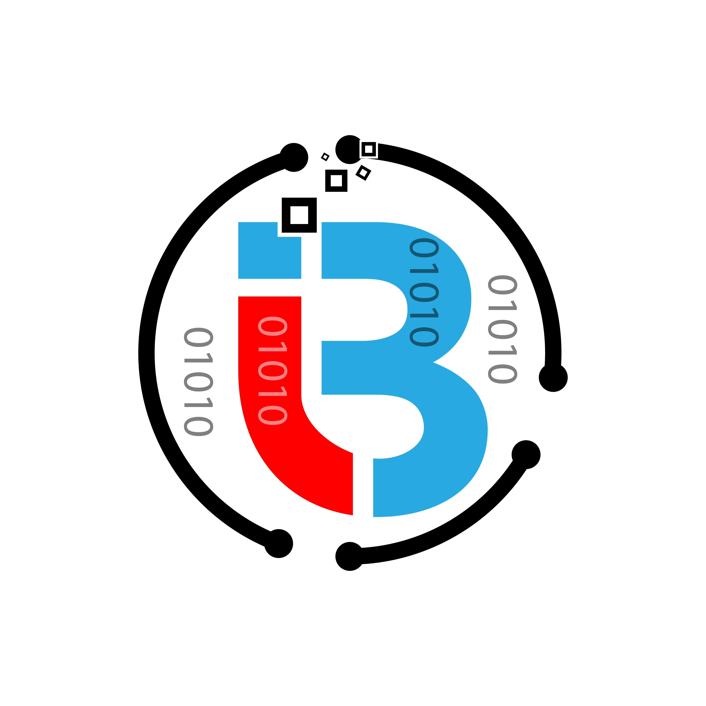

<h1 align="center"> Data Engineering Compass</h1>

  
  <h2 align="center">insightbyte.com.au</h2>
  
Articles, Video Tutorials, Learning Roadmaps and resources for Data Enginners

  

      
    
  

 

The intent of this guide is to give you an idea about the Data Engineering landscape and guide you on your learning jorney. 

This roadmap/compass should help you gardually grow into a well rounded Data Engineer.

We cover very basic concepts and we then put them into practice by implementing real life Data Engineering use cases.

 

